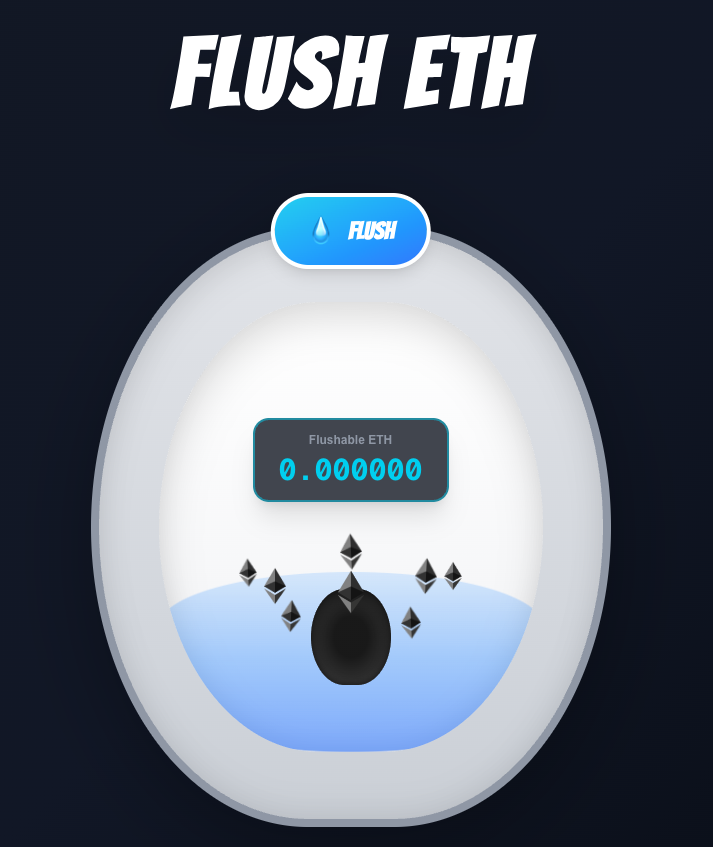

# Flush ETH 🚽

A toilet-themed web app that lets anyone call the permissionless `flush()` function on the [BETH](https://beth.ethcf.org/) contract to burn force-sent ETH.



## What is This?

The BETH contract can receive force-sent ETH (via `selfdestruct` or other means) that doesn't mint tokens. The `flush()` function is **permissionless** - anyone can call it to forward that ETH to the burn address `0x0000...0000`.

This site makes flushing that ETH easy.

## BETH Contract Addresses

- **Mainnet:** `0x2cb662Ec360C34a45d7cA0126BCd53C9a1fd48F9`
- **Sepolia:** `0xD5217239dA26A802D6dF68efA87cDd3B6f00c98e`

Learn more: [https://beth.ethcf.org/](https://beth.ethcf.org/)

## Getting Started

### Prerequisites

- Node.js 18.x or higher
- A [WalletConnect Project ID](https://cloud.walletconnect.com) (free)

### Installation

```bash
npm install
```

### Environment Setup

Create a `.env.local` file:

```bash
NEXT_PUBLIC_WALLETCONNECT_PROJECT_ID=your_project_id_here
```

### Run Development Server

```bash
npm run dev
```

Open [http://localhost:3000](http://localhost:3000) to see the app.

## How It Works

1. **Connect Your Wallet** - Click "Connect Wallet" in the top-right
2. **View Flushable ETH** - See how much force-sent ETH is ready to flush
3. **Hit the Flush Button** - Click the 💧 Flush button to call the `flush()` function

The number of floating ETH logos corresponds to the amount of flushable ETH (1 logo per 0.001 ETH).

## License

MIT
